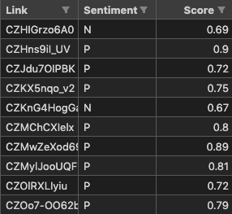

[//]: # (Write the title below)

# Projet Cassiopée - Understanding engagement in Instagram posts

[//]: # (write a subtitle )
## Yann MILLET, Brieuc POPPER, Mathieu MARTIAL

  
This project aims to discuss how differents factors such as the hour at which a post is posted, how many emojis are inside the post, or even how positive a post is is correlated with the number of likes or comments on the post.
Some interpretation can be done based on the statistics obtained.

This readme will explain the code used and how to use it.  

  
## 1. Creating the final database based on the database given by Nicolas SOULIE and Anahid BAUER

We started with this database https://www.dropbox.com/s/0s79gtrzbbffjh8/Insta_posts_Mars2023.dta?dl=0, which is called Insta_posts_Mars2023.dta. This database contains data from an Instagram scrape with approximately 20 000 posts from french newspapers which are from 2022 mostly.

You then open this database which is from stata in "finalDatabase.py" (which is commented to explain exactly what it does)

The needed dependencies are: pandas, numpy, matplotlib, datetime and emojis, and can be installed with "pip install <module>" in the terminal

A very useful function is statsOnDatabase() which can help debug and see if the manipulations we did on the database are correct.

The final output is a new database which all information comes from the .dta file, but with some new columns added and some columns dropped  

[//]: # (write in raw and in small the code used to create the final database)

After running workOnDatabase.py we get a database with 10923 rows and 17 columns, and here is some of the info printed out by statsOnDatabase():

The shape of the database is:  (10923, 17)
The columns of the database are:  Index(['link', 'newspaper', 'posted_at', 'nb_likes', 'nb_post_comments',
    'sum_post_comments_like', 'sum_post_comments_child', 'content', 'hour',
    'dow', 'month', 'toSort', 'timeSinceLastPost', 'nbCarac', 'nbHashtags',
    'nbMentions', 'nbEmojis'],
    dtype='object')

This database can then be completed with topic data and more.
  

## 2. Adding topic data

The file topic.py is the file doing the work here.
You need pandas and sklearn to run this, along with matplotlib to display results.

The goal is to extract popular topics and classify each post in one of these topics.
One of the topics will be "others" : it will contain much more posts than other topics but will be less relevant and very general.

Stop words are a set of commonly used words in a language (e.g., "the", "is", "in") that are often considered insignificant and do not carry much meaning in the context of natural language processing tasks like topic analysis or text classification. These words are typically filtered out from the input text to focus on the more important and meaningful words.

Here we take a stop word list for french in general and add some words that are not relevant for our analysis, based on some iterations of the code (words that appeared in very popular topics but were not relevant)
This stop word list may be edited and fine-tuned for better results !

Then extract_keywords_topic_analysis performs the analysis with a given number of topics and number of keywords per topic. It opens the databased created just above, and needs an engagement score which is defined here as number of likes + 3 * number of comments.

After that the analysis is finished, we have some code for visualization of the topics and some code to add the topic as a column in the database.

This new version of the database with added columns is then saved in topic.csv
  
## 3. adding sentiment analysis

This analysis is long to run on many posts (approximately 3 hours on a decent computer)

The file nlp.py is the file doing the work here.

For each post, we get if the post is negative or positive, along with a score that shows how sure the algorithm is of its prediction.

We end up with the file "finalDbWithSentimentMerged.csv", of which a short sample is shown below:  

  
## 4. merging in the sentiment analysis and finishing up the cleaning, dealing with categorical variables
Once we did the previous steps, we merge everything (topic.csv and the sentiments) based on the shortcode (the instagram link like CUZ3Z9XoZ0_)

This is done in mergeAndOneHotandClean.py

We the need to "oneHotEncode" categorical variables, so that we can use them in our models.

For example the day of week, which is in "Monday", "Tuesday", etc... is transformed into 7 columns, one for each day, and the value is 1 if the post was posted on this day, 0 otherwise.

This is done for all categorical variables.

Finally we obtain "toPredict.csv" and "predictWith.csv", we gave some copies of the one's we used in the repository, but you can get them with all these previous steps.

  
## 5. performing linear regression and random forest
Using "original-predictWith.csv" and "original-toPredict.csv" we can perform linear regression and random forest and any other model we can think of. You can also rebuild these files with the previous steps, to get more custom results, or to run with another scrap.

See the file "model.py" that explains in detail what is done.

To sum up, we predict with sentiment,hourGroup_aprem,hourGroup_finAprem,hourGroup_matin,hourGroup_nuit,hourGroup_soirTard,hourGroup_tresTot,dow_Friday,dow_Monday,dow_Saturday,dow_Sunday,dow_Thursday,dow_Tuesday,dow_Wednesday,season_automne,season_ete,season_hiver,season_printemps,timeSinceLastPost,nbCarac,nbHashtags,nbMentions,nbEmojis,relevantTopic_autre,relevantTopic_coupeDuMonde,relevantTopic_electionsParlementaires,relevantTopic_electionsPresidentielles,relevantTopic_guerreUkraine,relevantTopic_reformeRetraite,newspaper_lefigarofr,newspaper_lesechos,newspaper_lhumanitefr,newspaper_liberationfr,newspaper_valeurs_actuelles

And we can predict nb_likes,nb_post_comments,likesPerSubs,commentsPerSubs

The provided code does a detailed linear regression with statsmodels, then multiple other methods with sklearn and xgboost

You can then re-use the models to understand and interpret what they found (more complex than for linear regression), or do whatever else with them.
It is interesting to find the most interesting features : for example from "predictWith", using only 'hourGroup_aprem', 'dow_Wednesday','season_hiver','relevantTopic_autre','nbCarac','nbHashtags','relevantTopic_electionsParlementaires','season_ete', 'timeSinceLastPost','dow_Saturday' gives a decent r^2 alone

  
## ideas for the future
It would be interesting to try to eliminate the multicolinearity in our data before the linear regression, and see if it improves the results.

Techniques to reduce dimensionality, like PCA, could also be interesting to try.

We could also try to explain how the random forest, which has a good r^2, works, and what are the most important features.

Finally it would be interesting to look at things considering the temporal aspect and their evolution, and to also do very in-depth studies with only a few of the parameters involved.

